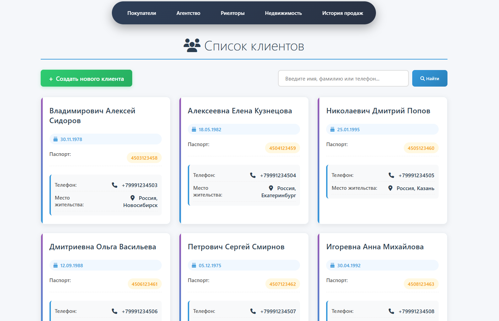

# Веб‑приложение для управления данными агентства недвижимости

## Описание

Estate-Agency — это Spring Boot веб‑приложение для управления объектами недвижимости, объявлениями, агентами и
клиентами. Приложение предоставляет интерфейс для создания, редактирования и поиска объявлений, ведения базы клиентов и
назначения просмотров; данные хранятся в PostgreSQL, а фронтенд реализован с помощью Thymeleaf.

## Технологии

- Java 17
- Spring Data JPA
- Spring Web MVC + Thymeleaf
- PostgreSQL (runtime)
- Lombok
- Spring Validation
- Maven

### *Пример*

